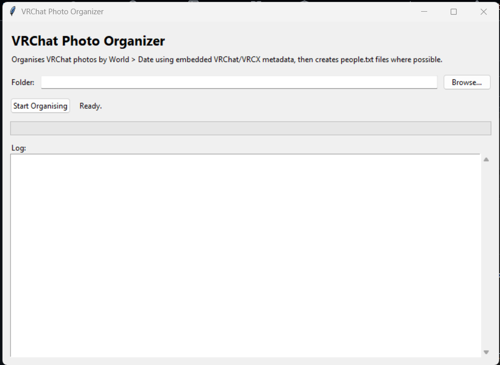

# VRChat Photo Organizer



A simple Windows-friendly GUI tool for organising VRChat photos.

It reads embedded VRChat/VRCX-style metadata from PNG photos, then sorts them into folders by world and date.

## Repository Description

A simple GUI tool that organises VRChat photos by world and date using embedded VRChat/VRCX metadata, with `people.txt` generation for detected users.

## Features

- Simple GUI
- Folder picker
- Progress bar
- Live log window
- Sorts by World > Date
- Creates `people.txt` files
- Handles duplicate filenames safely
- Writes a `sorter_log.txt` file
- Can be run as Python or built into an EXE

## What counts as a photo?

This tool is intended for VRChat photos that contain embedded metadata, typically generated through VRCX-assisted photo systems or other metadata-aware capture methods.

Standard SteamVR screenshots, Quest screenshots, Windows screenshots, headset captures, and images that do not contain readable VRChat metadata will be sorted into `Unknown_World`.

## Folder structure


When metadata is found, photos are sorted like this:

```text
World Name/
└─ 2026-06-01 - World Name/
   ├─ VRChat_2026-06-01_03-00-46.250_3840x2160.png
   └─ people.txt
```

The `people.txt` file contains any usernames and VRChat user IDs found inside the photo metadata.

## Unknown Worlds

If a photo does not contain readable VRChat/VRCX metadata, it will be placed into an `Unknown_World` folder.

This includes normal screenshots or prints saved into the same folder that were not created with readable VRChat metadata.

Those files will be sorted like this:

```text
Unknown_World/
└─ 2026-06-01 - Unknown_World/
   └─ photo.png
```

The date is taken from the filename where possible. If no VRChat-style date is found in the filename, the file's modified date is used instead.

## Metadata requirements

This tool relies on VRChat/VRCX metadata being embedded within the image file.

The metadata may include:

- World Name
- World ID
- Instance Information
- Player Names
- Player User IDs

This metadata appears to be available when photos are taken while using VRCX alongside VRChat.

It is possible that VRCX needs to be running in the background when the photos are taken for the metadata to be embedded correctly.

If all photos are being sorted into `Unknown_World`, check the metadata of one of your photos using a metadata viewer or ExifTool.

Useful metadata fields may include:

- `world_display_name`
- `world_id`
- `players`
- `author_id`

If these fields are missing, the organiser will not be able to determine which world the photo belongs to.

## How to run with Python

Install Python 3, then double-click:

```text
Run_GUI_Python.bat
```

Or run manually:

```bash
python vrchat_photo_organizer_gui.py
```

## How to build the EXE

Double-click:

```text
Build_EXE.bat
```

This installs PyInstaller if needed and builds the executable.

The finished EXE will be created here:

```text
dist/VRChat Photo Organizer.exe
```

## Safety note

This tool moves files.

Test it on a copied photo folder first before running it on your main collection.

## Why I made this

I take a lot of photos in VRChat worlds, especially for worldbuilding, avatar previews, posters, memories, and community moments.

This tool helps keep those photos organised by world and date, while also keeping track of who was in the instance when the metadata is available.

## Support the Project

This project is provided free of charge and open source.

If you'd like to support continued development of VRChat tools, worldbuilding projects, utilities, and community resources, consider supporting me on Patreon:

➡️ Patreon: https://www.patreon.com/Mellish_Penthouse

Your support helps fund hosting costs, software development, VRChat world creation, and future open-source releases.

Thank you for helping keep these projects available to the community.
